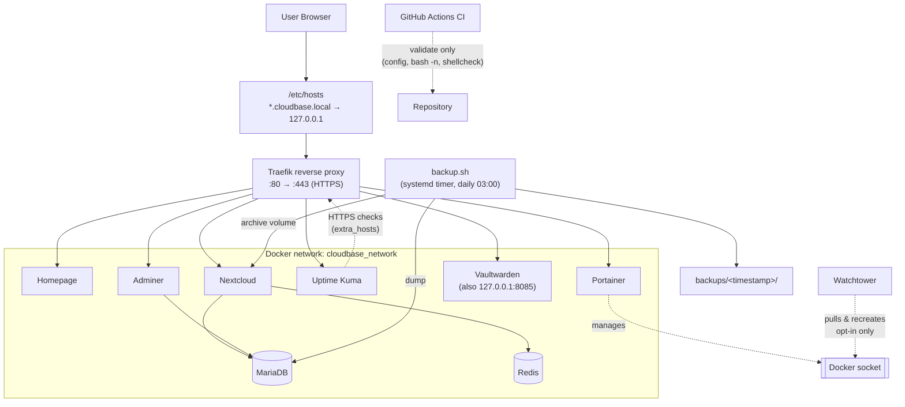

# CloudBase Lab — Architecture

## Purpose

CloudBase Lab is a **local, self-hosted homelab** built with Docker Compose. It
runs a small cloud stack (Nextcloud and friends) behind a single reverse proxy
with local HTTPS hostnames, plus the supporting services you need to operate it
safely: monitoring, container management, a password manager, automated image
updates, scripted backups and CI. Everything is designed to run on one host and
stay **local-only** by default — nothing is exposed to the internet unless you
deliberately configure a real domain and trusted certificates.

## Main components

| Component | Image | Role |
|---|---|---|
| **Traefik** | `traefik:v3.6` | Reverse proxy; terminates HTTPS on `:443`, routes by `*.cloudbase.local` Host header, redirects HTTP→HTTPS |
| **Homepage** | `nginx:alpine` | Static start/status dashboard |
| **Nextcloud** | `nextcloud:29` | Core cloud app (files, etc.) |
| **MariaDB** | `mariadb:lts` | Database backing Nextcloud |
| **Redis** | `redis:alpine` | Cache / file-locking for Nextcloud |
| **Adminer** | `adminer:latest` | Web DB admin UI |
| **Uptime Kuma** | `louislam/uptime-kuma:1` | Uptime monitoring |
| **Portainer** | `portainer/portainer-ce:lts` | Docker management UI |
| **Vaultwarden** | `vaultwarden/server:latest` | Bitwarden-compatible password manager (local-only) |
| **Watchtower** | `containrrr/watchtower` | Opt-in, label-based automatic image updates |
| **backup.sh** | host script | DB dump + Nextcloud volume archive + project files, with retention |
| **GitHub Actions CI** | workflow | Read-only validation on push/PR (never runs the stack) |

## Network flow

All containers share one user-defined bridge network, `cloudbase_network`
(fixed subnet so Nextcloud's `TRUSTED_PROXIES` is deterministic). Traefik is the
only edge: the browser hits `https://<service>.cloudbase.local`, which resolves
to `127.0.0.1` via the host's `/etc/hosts`, reaches Traefik on `:443`, and
Traefik routes to the target container by Host header over the internal network.
The local certificate is **self-signed** (fine for LAN/loopback, not for public
exposure).

## Storage and volumes

Stateful data lives in **named Docker volumes** (never bind-mounted into the
repo):

| Volume | Used by | Contents |
|---|---|---|
| `cloudbase_nextcloud_data` | Nextcloud | `/var/www/html` (app, config, user data) |
| `cloudbase_mariadb_data` | MariaDB | Database files |
| `cloudbase_uptimekuma_data` | Uptime Kuma | Monitors + admin account (bcrypt-hashed) |
| `cloudbase_portainer_data` | Portainer | Portainer settings |
| `cloudbase_vaultwarden_data` | Vaultwarden | Vault data |

Redis is cache-only and has **no** named volume by design. The homepage is
served read-only from `./homepage`.

## Backup flow

`scripts/backup.sh` (run manually or via the user-scoped systemd timer at 03:00
daily) produces a timestamped folder `backups/YYYY-MM-DD_HH-MM-SS/` containing:

- `mariadb_dump.sql.gz` — `mariadb-dump --all-databases`, gzipped,
- `nextcloud_data.tar.gz` — tar of the Nextcloud volume,
- `project-files/` — `docker-compose.yml`, `.env.example`, `README.md`,
  `homepage/index.html`, `scripts/restore-notes.md`.

Old backups are pruned by retention (default 7 days). `.env` is **not** included
unless `--include-env` is passed. Integrity is checked with
`scripts/verify-backup.sh` (read-only). Restore is manual and deliberate — see
[`restore-test.md`](restore-test.md) and [`../scripts/restore-notes.md`](../scripts/restore-notes.md).

## Monitoring flow

Uptime Kuma runs inside `cloudbase_network`. It can check services either by
**internal container name** (plain HTTP, no TLS/DNS concerns) or via the full
**HTTPS Traefik path** — for the latter, the `uptime-kuma` service carries an
`extra_hosts` block mapping each `*.cloudbase.local` hostname to `host-gateway`
so the container reaches Traefik. MariaDB and Redis are not HTTP services and are
monitored via TCP checks, container healthchecks, or (later) exporters. Details
in [`monitoring.md`](monitoring.md).

## Security notes

- **Local-only by default.** Vaultwarden's direct port is bound to `127.0.0.1`;
  the self-signed cert and `*.cloudbase.local` hostnames are for LAN/loopback.
- **Secrets stay out of Git.** `.env` (and `.env.save`/`.env.bak`/…) are
  git-ignored; only `.env.example` (placeholders) is tracked.
- **Vaultwarden** keeps signups closed and the `/admin` panel disabled unless a
  self-generated token is set.
- **Docker socket:** Traefik mounts it **read-only**; Portainer and Watchtower
  need **read-write** — all kept local-only.
- **CI is read-only:** it validates config and scripts, never starts the stack
  or prints secrets.
- Enable Let's Encrypt only with a real, publicly resolvable domain before
  exposing anything.

## Update strategy

Watchtower runs with `WATCHTOWER_LABEL_ENABLE=true` — it updates **only**
containers that opt in with `com.centurylinklabs.watchtower.enable=true`.
Currently only stateless **Homepage** and **Adminer** opt in. Stateful/critical
services (**Nextcloud, MariaDB, Redis, Traefik, Vaultwarden, Portainer, Uptime
Kuma**) are updated **manually and tested**. The check runs daily at **04:00**,
just after the 03:00 backup, so updates always have a fresh backup to fall back
on. See the README "Automatic updates (Watchtower)" section.
