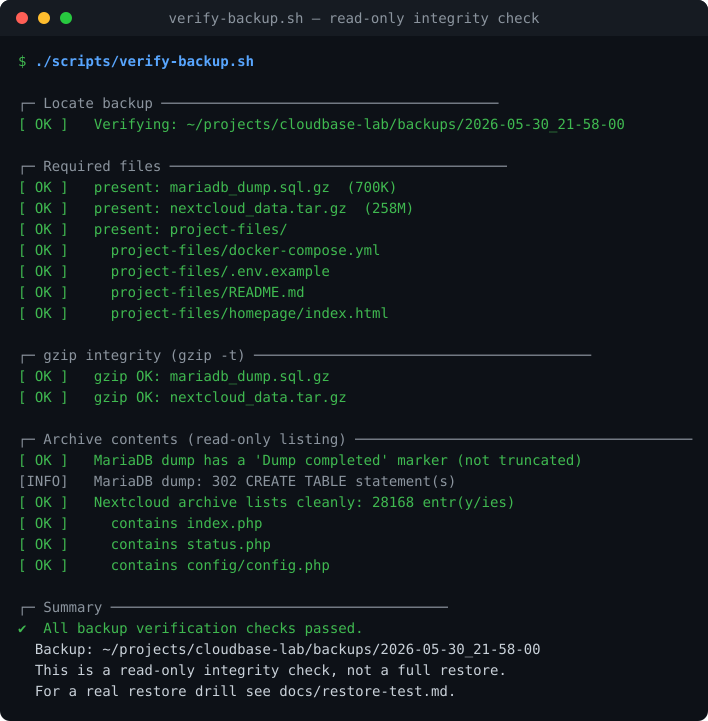
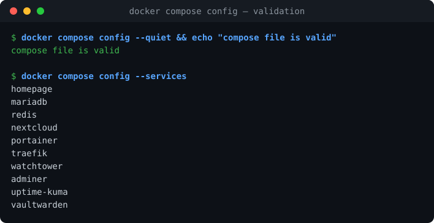
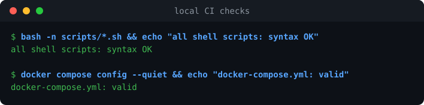

# CloudBase Lab — Screenshots

Screenshots make the project tangible for readers who will not run the stack
themselves. They live in `docs/images/` and are embedded below.

All committed images are **real captures** — no mock-ups, no invented
dashboards. Terminal-style SVGs are rendered from actual command output with
[`docs/scripts/render-terminal-snapshot.py`](scripts/render-terminal-snapshot.py)
(stdlib-only helper, documentation use only).

## Available images

| Image | What it shows | Source |
|---|---|---|
| `images/backup-check.svg` | `verify-backup.sh` run against a real backup — all read-only integrity checks pass (gzip test, dump marker, archive listing) | `./scripts/verify-backup.sh` |
| `images/docker-compose-config.svg` | Compose file validates cleanly; all 10 services listed | `docker compose config --quiet` / `--services` |
| `images/ci-check.svg` | Local CI checks: shell script syntax + compose validation | `bash -n scripts/*.sh`, `docker compose config` |







> Note: `docker compose ps` was not captured as an image because the stack was
> not running at capture time — an empty table proves nothing. Capture it once
> the stack is up (see below).

## How to re-create a snapshot

```bash
# 1. Capture real output to a text file (prefix commands with "$ "):
{ echo '$ ./scripts/verify-backup.sh'; ./scripts/verify-backup.sh | sed -e 's/\x1b\[[0-9;]*m//g'; } > /tmp/backup-check.txt

# 2. Render it:
python3 docs/scripts/render-terminal-snapshot.py /tmp/backup-check.txt docs/images/backup-check.svg "verify-backup.sh — read-only integrity check"
```

## Pending manual captures

These need the running stack and a browser (some behind logins) and are
intentionally **not** faked:

- [ ] `images/homepage.png` — Homepage dashboard with links to all services
- [ ] `images/traefik-dashboard.png` — Traefik dashboard, routers for every `*.cloudbase.local` hostname
- [ ] `images/uptime-kuma.png` — Uptime Kuma with the HTTP/TCP monitors green
- [ ] `images/nextcloud.png` — Nextcloud over `https://nextcloud.cloudbase.local`
- [ ] `images/portainer.png` — Portainer showing the `cloudbase-*` containers healthy
- [ ] `images/docker-compose-services.svg` — `docker compose ps` with the stack running (all services `Up`)
- [ ] `images/github-actions-ci.png` — capture manually from the GitHub Actions tab after a green CI run

## Capture checklist (redaction)

Before committing any screenshot:

- [ ] No real passwords, tokens, session URLs or personal e-mail addresses visible
- [ ] No real file names / calendar entries in Nextcloud views
- [ ] Vaultwarden: never screenshot vault contents — the login page is enough
- [ ] Replace `/home/<user>` paths with `~` in terminal captures
- [ ] Prefer the `https://*.cloudbase.local` URLs in the address bar (shows the
      Traefik + HTTPS path)
